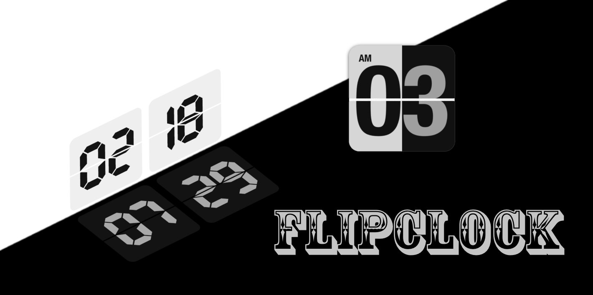
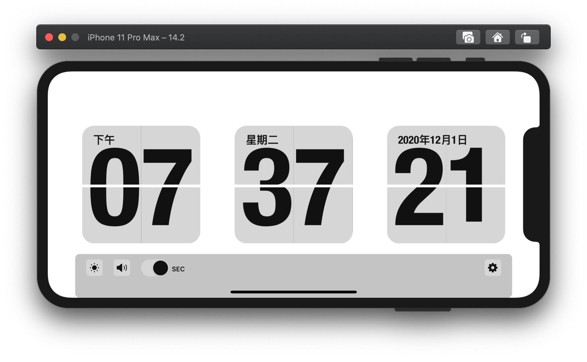
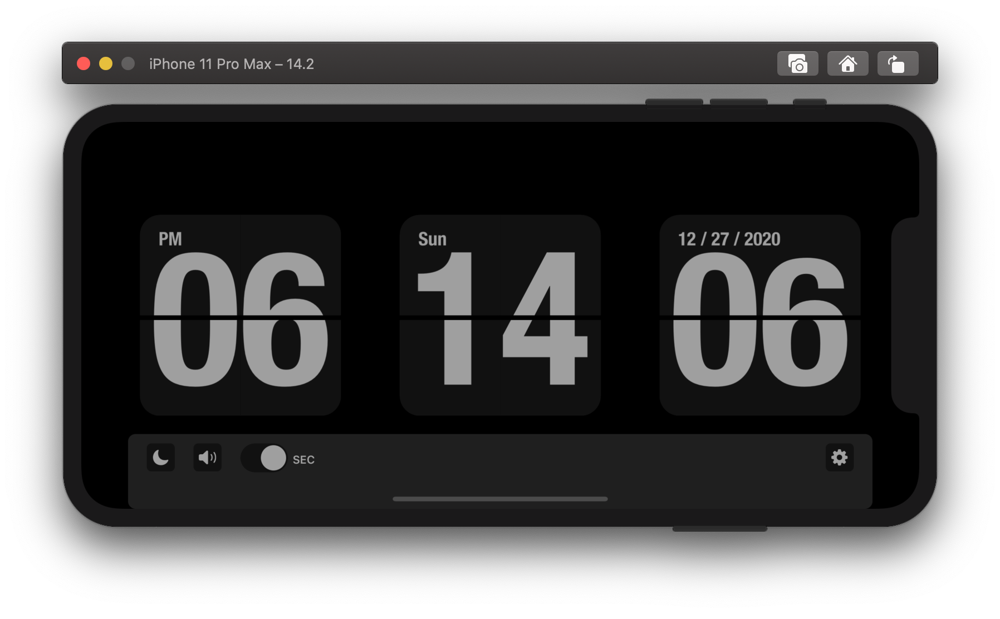
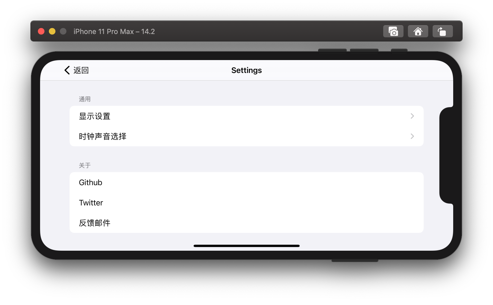
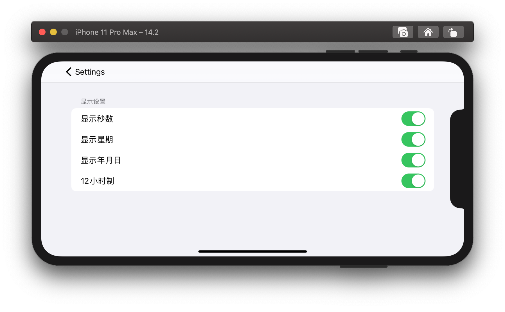
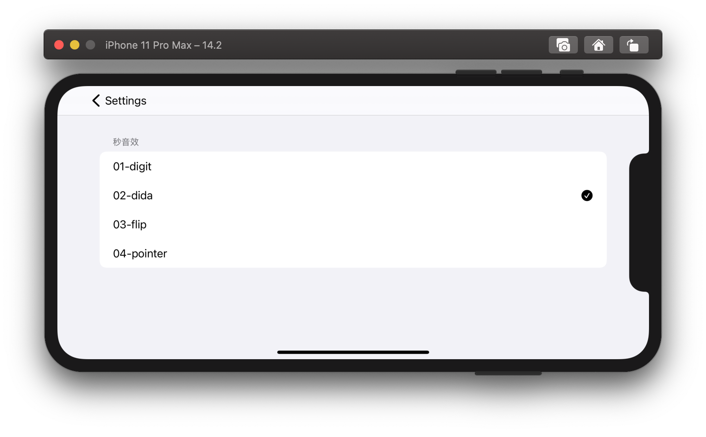

 <b>FlipClock It's a minimalist page turning clock. </b>

### Public Attribute
|  Attribute name	|  Specific introduction of attributes |
| :------------: | :------------: | 
| `date` | time |
| `is12HourClock` | Whether it is a 12-hour clock (default: 24-hour clock. FALSE)|
| `weekdayIsVisible` | Whether it is visible on working days and ordinary days. (Except Sunday and Saturday) any day |
| `yearMonthDayIsVisible` | Is the year, month, and day visible |
| `secondIsVisible` | Is the second visible |
| `font` | Page Turn Clock Custom Font |
| `flipClockTheme` | Clock Theme (default: darkTheme)  |

### Features
**2020-12-01**

- Add clock localization (Chinese, English)
- Add bottom view toolbar
- Add UserDefaults to store related settings
- Add light and dark mode switching themes.
- Add second sound effect, When the distinguished seconds are not visible, it will be played every minute. Whether to play once every second.
- Fix the interface layout when seconds are not visible.
- Add user setting function.

**2019-03-17**

- Add 12-hour system conversion, the default is 24-hour system.
- Add more date content display.

### Design
Description | Preview |
----|------|
LightTheme |  |
DarkTheme |  |
UserSettings |  |
DisplaySetting |  |
SecTone |  |

### Author
|   |  [DevLiuSir](https://github.com/DevLiuSir)  Software Engineer  [][1] [][2] [][3]|
| :------------: | :------------: |

[1]: https://twitter.com/LiuChuan_
[2]: https://github.com/DevLiuSir
[3]: https://devliusir.com/
